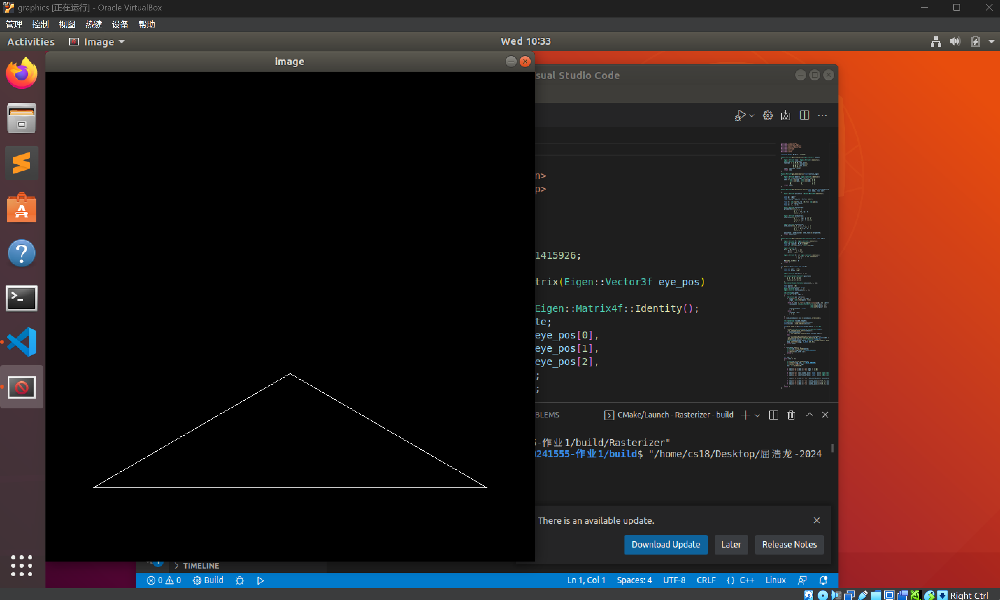
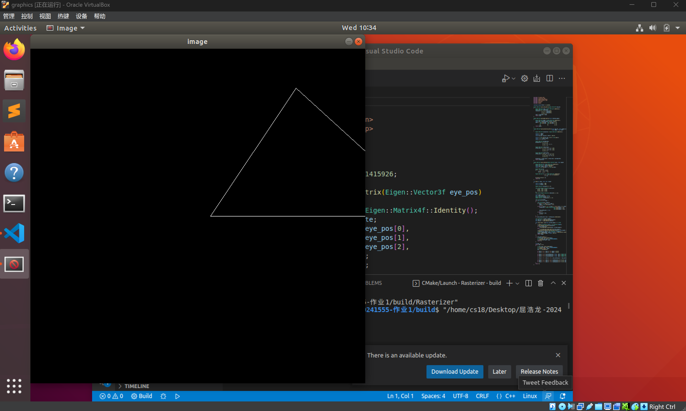
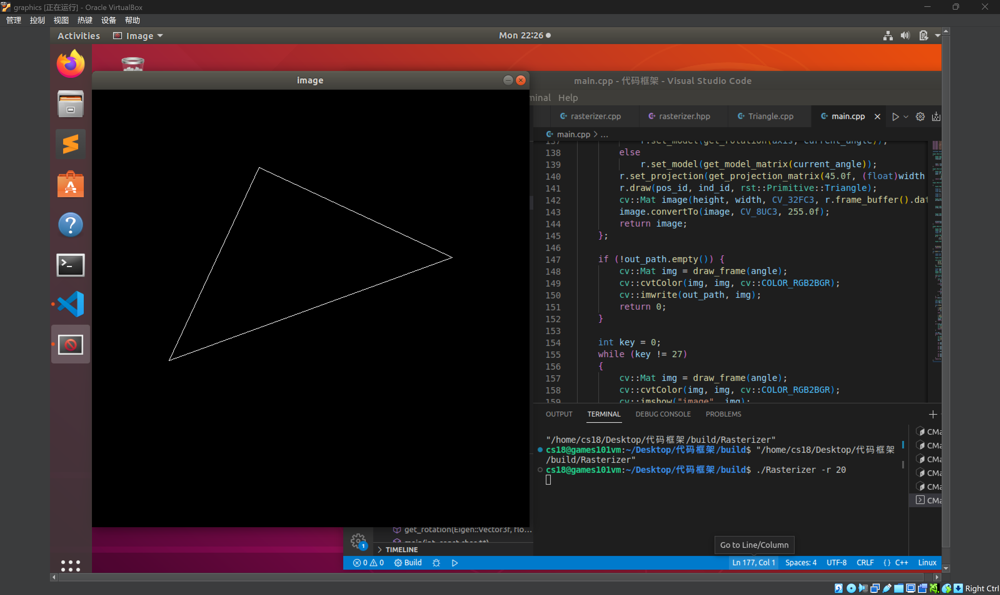
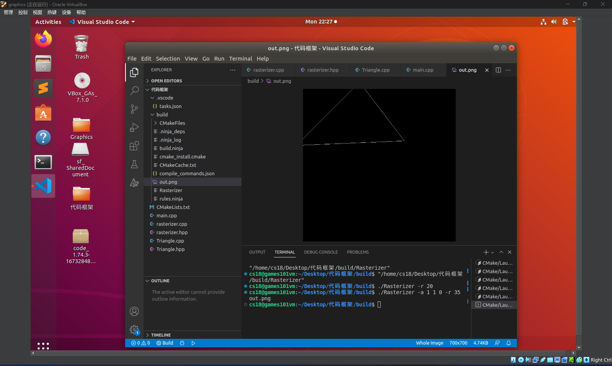

# 旋转与投影 

项目：CPU 光栅化器中的模型/视图/投影矩阵与交互式旋转

---

## 1. 项目概述

本项目在给定的渲染框架上，实现了：

- **绕 z 轴的模型变换矩阵** `get_model_matrix(float rotation_angle)`；
- **透视投影矩阵** `get_projection_matrix(float eye_fov, float aspect_ratio, float zNear, float zFar)`；
- **（提高项）任意过原点轴的旋转矩阵** `get_rotation(Eigen::Vector3f axis, float angle)`；
- **交互/命令行** 两种运行方式：可视化窗口按键旋转，或命令行输出图像文件。

三角形顶点为 `v0(2,0,-2)`, `v1(0,2,-2)`, `v2(-2,0,-2)`，通过 **MVP** 变换与视口映射后，以**线框**方式绘制。

---

## 2. 目录结构

```
.
├── CMakeLists.txt
├── main.cpp
├── rasterizer.hpp
├── rasterizer.cpp
├── Triangle.hpp
└── Triangle.cpp
```

---

## 3. 依赖

- **CMake ≥ 3.10**
- **C++17** 编译器（如 `g++`）
- **Eigen3**（头文件库，通常位于 `/usr/include/eigen3`）
- **OpenCV**（用于图像显示与写出）

---

## 4. 运行方式

### 4.1 GUI 模式（交互旋转）

```bash
./Rasterizer
```

- **按键说明**
  - `A / D`：以 10° 步进绕当前轴 **正/负方向** 旋转
  - `1 / 2 / 3`：将自定义旋转轴切换为 **X / Y / Z** 轴（并启用“自定义轴”模式）
  - `B`：开/关 “自定义轴” 模式（关闭时回退为固定的绕 z 轴旋转）
  - `J / K / L`：分别对自定义轴的 `x / y / z` 分量 **+0.1** 微调（自动单位化）
  - `Esc`：退出程序

### 4.2 命令行模式（直接输出图像文件）

无需弹出窗口，直接将结果保存到文件：

```bash
./Rasterizer -r 20

./Rasterizer -r 20 image.png

./Rasterizer -a 1 1 0 -r 35 out.png
```

---

## 5. 核心实现说明

### 5.1 模型矩阵（绕 z 轴旋转）

- 使用标准的二维平面旋转（嵌入到 4×4 齐次矩阵），角度由度转弧度。

### 5.2 透视投影矩阵

- 采用 **透视到正交** 的拆分：先构造 `persp2ortho`，再进行平移与缩放得到标准立方体（NDC）。
- 视角 `eye_fov` 与宽高比 `aspect_ratio` 推导出上/右边界 `t, r`，近平面/远平面采用 OpenGL 风格的 **负号约定**。

### 5.3 （提高项）任意轴旋转矩阵

- 采用 **Rodrigues** 公式：`R = c I + (1-c) kk^T + s [k]_x`，其中 `k` 为单位轴向量。封装为 `get_rotation(axis, angle)`，并在交互与命令行中均可使用。

---

## 6. 结果与验证

- **GUI 测试**：运行后可看到线框三角形，按 `A/D` 键可稳定、连贯地旋转，`1/2/3` 与 `B` 能正确切换/开关自定义轴；`J/K/L` 可观察到旋转轴方向的微调效果。
- 
- 
- 
- **CLI 测试**：命令行指定角度与文件名能正确写出 PNG 图像；未指定文件名时默认输出 `output.png`。
- 
- 

---

## 7. 评分项自查对照

- [x] **模型矩阵（20 分）**：`get_model_matrix` 已实现绕 z 轴旋转；
- [x] **投影矩阵（20 分）**：`get_projection_matrix` 采用透视→正交的标准推导；
- [x] **能正确运行（20 分）**：可执行文件创建窗口并绘制线框三角形；
- [x] **交互/命令行（20 分）**：支持 `A/D` 键旋转；亦支持 `-r` 参数直接输出图像；
- [x] **（提高项 20 分）任意轴旋转**：`get_rotation` + 交互按键与命令行 `-a` 已支持。

祝批改顺利！
